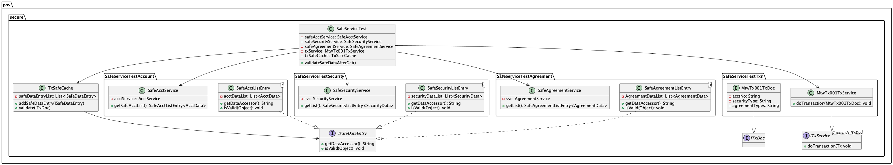
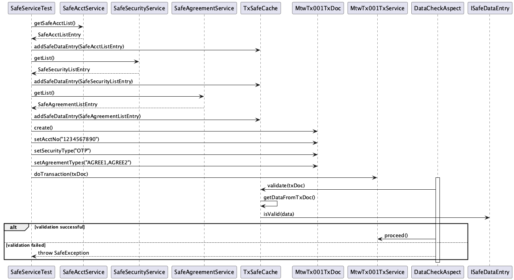

# smart-component-transaction-reliability-strategy

以為智能組件的可靠性交易策略

**主要機制**

- [ ] 功能啟動時由智能組件生成 txntoken，後送後由 Dispatcher 透過 GateService 啟用 txntoken
- [ ] 智能組件接收 prop txntoken，所有對後端請求都會帶上，確認智能組件是為那個功能提供服務
- [ ] 每個智能組件都會有對應的 GateService，負責接收 Dispatcher 的請求，並使用 txntoken 從 GateSession 取得/寫入 資料
  - [ ] 對應的 GateService 會在載入資料時把資料暫存在 GateSesion 中，供交易執行時驗證
- [x] 交易執行時同步驗證智能組件資料，執行時會透過 AOP 強制啟動各個智能組件的 GateService 驗證，如果有錯就會回 Excption

**非功能考量**

- [ ] 為何需要 activate txntoken？
  - 要確保每個智能組件的請求都是為了特定交易而執行

**智能組件**

- [ ] 與功能相關的智能組件
  - [x] 帳號(Account)
  - [x] 同意書(Agreement)
  - [x] 安全控管(Security)
  - [ ] 一次交易(Transaction): 做過一次交易後，GateSession 裡的狀態就會註記為 Completed，無法再做交易
- [ ] 與功能無關的智能組件
  - [ ] 廣告(Advertisement)
  - [ ] 最近消息(RecentMessage)

### Class Diagram



The class diagram illustrates the main classes in the project and their relationships. Key components include:

- `SafeServiceTest`: The main test class that orchestrates the validation process.
- `TxSafeCache`: Manages the cache of safe data entries and performs validation.
- `SafeAcctService`, `SafeSecurityService`, `SafeAgreementService`: Services for handling different types of data.
- `MtwTx001TxService`: Handles the transaction processing.
- `SafeAcctListEntry`, `SafeSecurityListEntry`, `SafeAgreementListEntry`: Represent safe data entries for different types of data.
- `MtwTx001TxDoc`: The transaction document class.

### Sequence Diagram



The sequence diagram shows the flow of the `validateSafeDataAfterGet()` test method:

1. The test method interacts with `SafeAcctService`, `SafeSecurityService`, and `SafeAgreementService` to retrieve safe data.
2. The retrieved safe data is added to the `TxSafeCache`.
3. An `MtwTx001TxDoc` is created and populated with test data.
4. The `doTransaction()` method of `MtwTx001TxService` is called with the transaction document.
5. The `DataCheckAspect` intercepts the method call and triggers the validation process using `TxSafeCache`.
6. If the validation is successful, the transaction proceeds; otherwise, a `SafeException` is thrown.

These diagrams provide a visual representation of the project's structure and the flow of the validation process implemented in the test.

```

```
